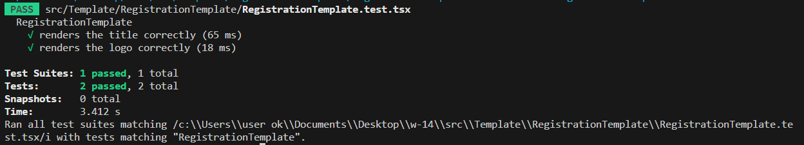
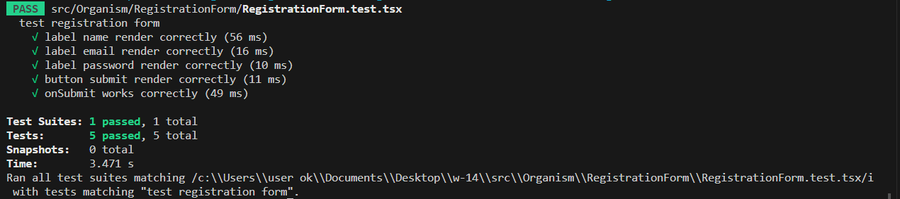
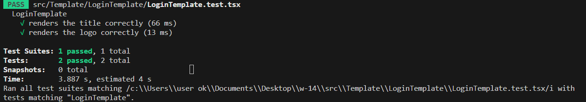
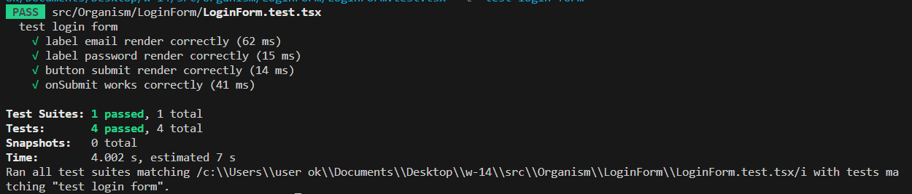
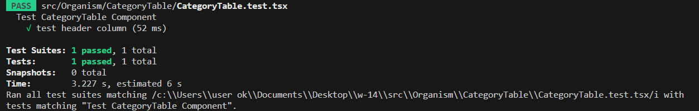
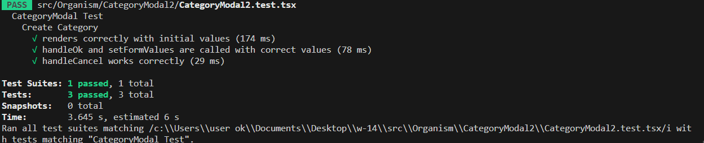
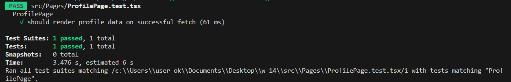
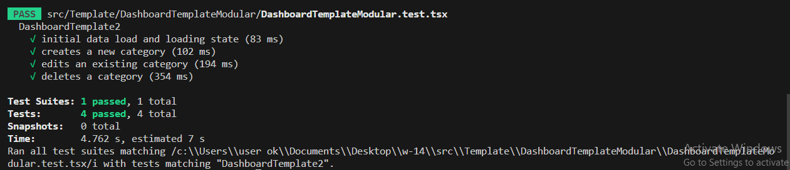

# Project 

## Live Deployment

- [Netlify](https://superlative-bublanina-a7be24.netlify.app/)

## Scenarios

### 1. Login Page

- **Rendering:** Ensure that the login page is rendered correctly.
- **Unit Test:** \
   a. Verify that the page title "Sign in to your account" is correctly rendered.\
   b. Confirm that the logo is correctly rendered using `getByAltText('logo')`.\
   c. Ensure that the form can be submitted, and the token is correctly set in localStorage.

   

   d. Ensure that the labels "Your email" and "Password" are rendered correctly.\
   e. Validate that the "Sign in" button is rendered and working correctly, confirming form submission.\
   f. Ensure no unit tests fail.

   

### 2. Register Page

- **Rendering:** Ensure that the register page is rendered correctly.
- **Unit Test:** \
   a. Verify that the page title "Create your account" is correctly rendered.\
   b. Confirm that the logo is correctly rendered.\
   c. Ensure that the registration form can be submitted, the new user is created, and navigation to the login page  occurs.

   
   
   c. Ensure that the labels "Name", "Your email", and "Password" are rendered correctly.\
   d. Validate that the "Register" button is rendered and working correctly, confirming form submission with the correct data.\
   e. Ensure no unit tests fail.

   

### 3. Category Page

- **Rendering:** Ensure that the category page is rendered correctly.
- **Unit Test:** \
   a. Ascertain no unit tests fail.\
   b. Ensure unit tests can detect the table, validating the rendering of table headers and checking the data populated in the table.\

   

   c. Confirm that the `CategoryModal` component is rendering correctly with the initial values and that the "OK" and "Cancel" buttons function as expected.\
   d. Validate that the `handleOk` and `setFormValues` functions are called with the correct values and that the `handleCancel` function works correctly.\

   

### 4. Profile Page

- **Rendering:** Ensure that the profile page is rendered correctly.
- **Unit Test:** \
   a. Confirm the title "Profile Page" is correctly rendered.\
   b. Validate the rendering of profile data after a successful fetch from the backend.\
   c. Verify that user data, including ID, Name, and Email, are correctly rendered.\
   d. Ensure no unit tests fail.

   

### 5. Dashboard Page

- **Rendering:** Ensure that the Dashboard page is rendered correctly
- **Unit Test:** \
   a. Ensure the initial data is loaded, displaying the loading state and categories.\
   b. Verify that a new category can be created, the input field is editable, and the new category is displayed upon confirmation.\
   c. Confirm that an existing category can be edited and updated successfully, displaying the updated category name.\
   d. Validate that a category can be deleted, and it is removed from the displayed list.\
   e. Ensure no unit tests fail.

   

